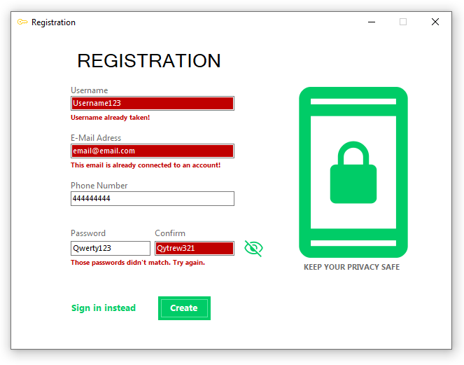

# About the Password Manager Project
Started the project back in the february 2023, after finishing some basic C# courses.
The project is not yet finished and is lacking few important functionalities. At the moment I am focused on refactoring my old code and trying to 
implement new things that I am learning every day.

Project contains this features at the moment:
- Creating a new account,
- Logging in with the existing account,
- Hashing password with salt.

##  What I've learned
At the beggining of my journey with WinForm I really liked the idea of it. Sadly later on I've noticed a lot of disadvantages
of this technology. After spending some time with WinForms and writing new features, my project started too look overcomplicated and
visual and logic codes were written at the same places which led to unreadable spaghetti code.

Recently I've been reading about architectural patterns (MVC, MVVM) and started working on making my code cleaner, easier to read and refactor.
At the moment I am trying to fix as much problems in the project as I can and upgrade it to my current standards and use the knowlage
I've gained.

 - Working on this project is helping me gain confiedence in writing a C# code,
 - I am getting better understanding of importance of writing a clean code,
 - Used the MS SQL Server,
 - Used SQL with C# for the first time,
 - Learned more about password hashing techniques and algorithms,
 - Encryption / Decryption,
 - Still learning a lot of interesting things that I will definetly use in the future.

### Signing in

### Registration and data validation

  
  
 

 
 ### View when you are logged in
 
 
 ### Hashed passwords and salt
  
  
